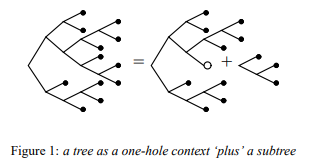

# ts_adt

本文以 typescript 为例说明 代数数据类型(ADT).

注意, 有另一个词是 抽象数据类型(ADT), 缩写一样, 但不要混淆它们.

由于个人能力有限, 而且还在学习中, **有些地方非常有可能是错的**. 请慎重参考.

另外这只是粗略的讲解, 并不是严格的定义, 如果希望了解更细节的部分可以看看[这个](https://proofassistants.stackexchange.com/questions/879/what-is-an-algebraic-data-type), 需要一些数学基础.

发布方式:[Attribution 4.0 International (CC BY 4.0)](https://creativecommons.org/licenses/by/4.0/deed.zh).

作者:[白羊](mailto:2451759073@qq.com).

## 类型

类型是什么? 是一类东西的总称.

比如`number`类型是所有数是总称, `string`类型是所有字符串的总称.

如果把类型看成集合, 那么值就是集合中的元素.

考虑无限集可能有些抽象, 那么考虑`boolean`类型吧, `boolean`是一个类型, 它下面有两个值, 分别是`true`和`false`.

所以如果一个值是`boolean`类型, 那么它要么是`true`, 要么是`false`, 没有其他可能.

那么, 有没有空集呢? 有, 在 typescript 里就是`never`, 没有任何值属于这个类型, 所以如果一个值的类型是`never`, 你无法给他赋值.

有没有只有一个元素的集合呢? 也有, 在 typescript 里, `void`类型下面只有一个值, 就是`undefined`. 所以你可以写:

```typescript
var a: void = undefined;
```

除此之外, typescript 允许用数字和字符串作为类型, 例如:

```typescript
type a = 1;
type b = "aaa";
```

a 是一个类型, 这个类型下面只有一个值, 就是`1`.

b 是一个类型, 这个类型下面只有一个值, 就是`'aaa'`.

在下面, 我使用`size`来表示属于该类型的值的个数.

比如:

```
size(number) = 无穷
size(string) = 无穷
size(boolean) = 2
size(1) = 1
size(2) = 1
size('aaa') = 1
size(void) = 1
size(never) = 0
```

## 类型组合

类型可以组合, 形成新的类型, 组合的方式有两种: `和` 和 `积`.

看一个例子:

```typescript
type a = 1;
type b = 2;
type c = a | b;
```

意为类型 c 是`类型 a 或 类型 b`, 而 a 是 1,b 是 2, 所以如果某个值的类型是 c, 那么它只可能是 1 或者 2.

可以看到:

```
size(c) = size(a) + size(b)
```

这种组合方式称为`和`.

另一个例子:

```typescript
type a = boolean;
type b = 1 | 2;
type c = [a, b];
type d = { x: a; y: b };
```

意为类型 c 是两个元素的数组, 其中第一个元素是`boolean`类型, 第二个元素是`1 | 2`类型.

所以如果某个值的类型是 c, 那么它只可能是:

```
[true, 1]
[true, 2]
[false, 1]
[false, 2]
```

可以看到:

```
size(c) = size(a) * size(b)
```

这种组合方式称为`积`.

再看类型 d, 它是一个同时包含`x, y`的结构, 其中 x 是 boolean, y 是`1 | 2`类型.

这其实与 c 并没有本质区别, 只是组织数据的形式不一样而已. 这里还是有:

```
size(d) = size(a) * size(b)
```

这种通过 `和` 和 `积` 构造新类型的体系叫做代数数据类型(ADT).

顺着这个概念继续向下, 可以到很深的地方.

## 泛型

来看看泛型:

```typescript
type F<a> = a;
```

那么类型`F<a>`的大小取决于什么? 取决于`a`是什么.

如果`a`是`string`, 那么`size(F<a>)`就是无穷.

如果`a`是`boolean`, 那么`size(F<a>)`就是 2.

如果`a`是`never`, 那么`size(F<a>)`就是 0.

可以看到:

```
size(F<a>) = size(a)
```

如果有多个类型呢? 那么就看泛型是如何组合的:

```typescript
type G<a, b> = a | b;
type H<a, b> = [a, b];
type K<a, b, c> = [a, b] | k;
```

可以看到:

```
size(G<a, b>) = size(a) + size(a)
size(H<a, b>) = size(a) * size(a)
size(K<a, b, c>) = size(a) * size(a) + size(c)
```

## 函数类型

考虑这个例子:

```typescript
type a = 1 | 2 | 3;
type b = boolean;
type c = (arg: a) => b;
```

我们现在要研究类型`c`的取值可能性.

例如, 我可以实现一个函数, 它使得这个函数输入 1 时返回 true, 输入 2 时返回 false, 输入 3 时返回 true.

这是类型`c`的一种取值, 我们现在想知道它一共有多少种取值.

```
1 -> false, 2 -> false, 3 -> false
1 -> false, 2 -> false, 3 -> true
1 -> false, 2 -> true, 3 -> false
1 -> false, 2 -> true, 3 -> true
1 -> true, 2 -> false, 3 -> false
1 -> true, 2 -> false, 3 -> true
1 -> true, 2 -> true, 3 -> false
1 -> true, 2 -> true, 3 -> true
```

可以看到:

```
size((arg: a) => b) = size(b)^size(a)
```

也许你会问多参数函数怎么办? 显然, 多参数函数时, 函数参数是积类型的关系.

所以:

```
size((arg1: a1, arg2: a2) => b) = size(b)^(size(a1)*size(a2))
```

以此类推.

总结来说, 函数的大小等于`size(返回类型)^size(参数类型)`

## 递归类型

可以构造一个 List 类型:

```typescript
type List<A> = ["Nil"] | ["Cons", A, List<A>];
```

可以很完美的用这个类型表达一个列表:

```typescript
var a0 = ["Nil"]; // []
var a1 = ["Cons", 1, ["Nil"]]; // [1]
var a2 = ["Cons", 1, ["Cons", 2, ["Nil"]]]; // [1, 2]
var a3 = ["Cons", 1, ["Cons", 2, ["Cons", 3, ["Nil"]]]]; // [1, 2, 3]
```

来分析一下这个类型, 这首先是一个和类型.

前半段`['Nil']`的大小是`1`.

后半段`["Cons", A, List<A>]`是一个积类型, 它的大小取决于`A`和`List<A>`的大小, 是`size(A) * size(List<A>)`.

所以:

```
size(List<A>) = 1 + (size(A) * size(List<A>))
```

这个公式里, `size(A)`是类型`A`的大小, `size(List<A>)`是类型`List<A>`的大小.

总结来说, 类型`List<A>`的大小取决于类型`A`的大小, 所以`size(A)`是自变量, `size(List<A>)`是因变量.

为了简单, 我们把自变量写成 x, 因变量就可以写成 F(x).

我们可以得到:

```
F(x) = 1 + (x * F(x))
```

对它做一些数学处理:

```
F(x) = 1 + (x * F(x))
F(x) - (x * F(x)) = 1
F(x) * (x - 1) = 1
F(x) = 1 / (- (x - 1))
F(x) = 1 / (1 - x)

对 F(x) 做 x=0 时的泰勒展开:
在x=0点的泰勒公式: F(x) = F(0) + ∑(((F在x=0时的n阶导数)*(x^n))/n!) + Rn(x)

现在 F(x) = 1 / (1 - x)
所以 F(x)的一阶导数 = 1 / (1-x)^2
所以 F(x)的二阶导数 = 2 / (1-x)^3
以此类推 F(x)的n阶导数 = n! / (1-x)^(n+1)

因为我们要在x=0点展开, 所以令x=0, 则
F(0) = 1
F在x=0时的一阶导数 = 1
F在x=0时的二阶导数 = 2
...
F在x=0时的n阶导数 = n!

代入可以得到:
F(x) = F(0) + ∑(((F在x=0时的n阶导数)*(x^n))/n!) + Rn(x)
F(x) = 1 + ∑((n!*(x^n))/n!) + Rn(x)
F(x) = 1 + ∑(x^n) + Rn(x)
F(x) = 1 + x^1 + x^2 + x^3 + ...
```

回头看看我们之前的分析, 这里`F(x)`是`size(List<A>)`, `x`是`size(A)`. 也就是:

```
size(List<A>) = 1 + size(A)^1 + size(A)^2 + size(A)^3 + ...
```

从类型的角度看, 加是和类型, 平方是联乘, 也就是积类型.

`1`很好理解, 就是空列表的情况, 会是`['Nil']`.

`size(A)^1`是什么? 就是列表只有一个元素的情况, 也就是`['Cons', A, ['Nil']]`.

`size(A)^2`就是列表只有两个元素的情况了, 也就是`['Cons', A, ['Cons', A, ['Nil']]]`.

这个类型实际上等价于两个 A 类型的积类型, 所以它的大小是`size(A) * size(A)`, 也就是`size(A)^2`.

以此类推...

这并不是一个巧合, 对于其他常见的递归类型, 这样操作也有同样的意义, 比如`树`:

```typescript
type Tree<A> = ["Tip"] | ["Node", Tree<A>, A, Tree<A>];
```

它的大小是

```
size(Tree<A>) = 1 + size(Tree<A>) * size(A) * size(Tree<A>)
size(Tree<A>) = 1 + size(A) * size(Tree<A>)^2
```

对它移项, 整理, 做泰勒展开后, 得到:

```
size(Tree<A>) = 1 + size(A) + 2*size(A)^2 + 5*size(A)^3 + 14*size(A)^4 + ...
```

`1`就是只有树顶的情况, 也就是`["Tip"]`.

`size(A)`就是有一个节点的情况, 也就是`["Node", ["Tip"], A, ["Tip"]]`.

`size(A)^2`就是有两个节点的情况, 这个情况存在两种异构, 所以乘了 2.

就是`["Node", ["Node", ["Tip"], A, ["Tip"]], A, ["Tip"]]`,

和`["Node", ["Tip"], A, ["Node", ["Tip"], A, ["Tip"]]]`.

以此类推...

## 单孔上下文

考虑一个 List:

```
[1,2,3,4,5,6]
```

可以在它中间挖个'洞', 把洞里的数据取出来, 剩下的 List 则分成了两个部分:

```
3 [1,2] [4,5,6]
```

这称为'单孔匹配', 这里, `3`是匹配结果, `[1,2]`和`[4,5,6]`是它的上下文.

现在考虑:

```typescript
type c<A> = [A, A, A];
```

类型`c`的单孔匹配有多少个?

如果我们把匹配的位置写成下划线, 则有:

```
[_, A, A]
[A, _, A]
[A, A, _]
```

对于每种匹配, 有多少种可能? 其实这就是个`积`类型, 所以每种匹配的大小是`size(A) * size(A)`.

一共有三种匹配, 所以总数是`3 * size(A) * size(A)`, 也就是`3 * size(A)^2`.

如果是`[A, A, A, A]`呢? 总数是`4 * size(A)^3`.

这是什么? 这就是微分.

更一般的, 在上面我们说 List 可以写成:

```
F(x) = 1 / (1 - x)
```

其中`F(x)`指`size(List<A>)`, `x`指`size(A)`.

现在对它求导:

```
F(x) = 1 / (1 - x)

这是个除法形式的函数, 用公式 (u/v)' = (u'v-v'u) / (v^2).
F'(x) = -(1-x)' / (1-x)^2
F'(x) = 1 / (1-x)^2
F'(x) = (1 / (1-x))^2

又因为F(x) = 1 / (1 - x)
所以
F'(x) = F(x)^2
```

我们说`F(x)`指`size(List<A>)`, 那么`F(x)^2`值什么? 就是两个列表的大小.

这正是'单孔上下文'的大小, 一个列表被分开后, 它的左右两个上下文都是列表, 所以是`F(x)^2`.

对其他的结构, 例如`树`也有相同的规律. 树的单孔上下文如图:



\* [图片来自这里](http://strictlypositive.org/diff.pdf)

对多泛型的类型, 它的单孔上下文对应着给定泛型的偏微分.

## 非常规类型

例如`集合`一类的非常规类型也能在 ADT 中找到对应, 但比较复杂这里就不说了, 可以看引用资料 1.

## 意义

那么这些有什么用呢?

首先, ADT 是一种建模方法, 总结来说, 它定义了类型, 定义了类型如何组成新的类型, 这是从 0 到 1.

很多语言都把 ADT 作为了基础建模, typescript 是其中之一.

其次, ADT 有这些有趣的性质, 这些性质可以给我们更多的帮助.

例如, 我们可以方便的计算类型的大小, 那么我们就可以比较两个类型的大小.

较小的类型可以`无损`的转换到较大的或者等大的类型中, 但较大的类型转换到较小的类型时一定会损失一些信息.

这有助于帮助我们对数据结构重构, 只要保证两个类型的大小一致, 就可以让他们表示相同的数据.

单孔上下文更是有各种用途.

比如, 通过单孔操作访问数据结构中的值时, 可以算出它的上下文结构, 这对算法优化, 类型提示都有帮助.

## 引用和参考

[1] https://www.youtube.com/watch?v=YScIPA8RbVE

[2] http://strictlypositive.org/diff.pdf

[3] https://fsharpforfunandprofit.com/posts/type-size-and-design/

[4] http://zhangyi.xyz/fp-and-domain-model/

[5] https://codewords.recurse.com/issues/three/algebra-and-calculus-of-algebraic-data-types
